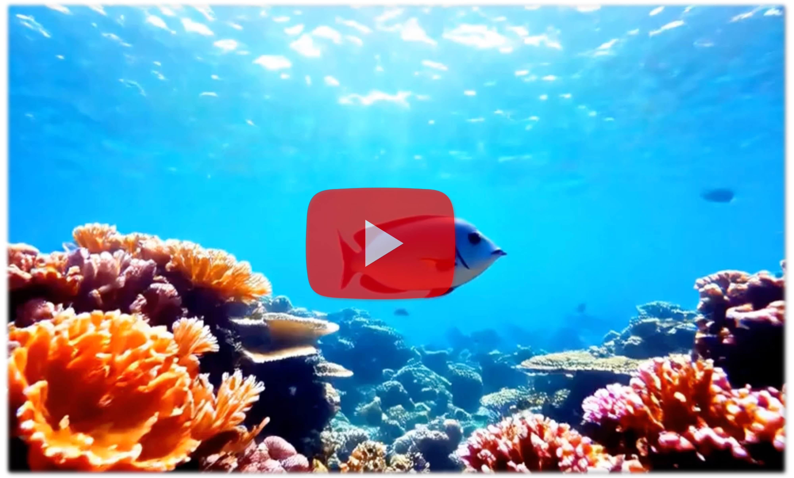
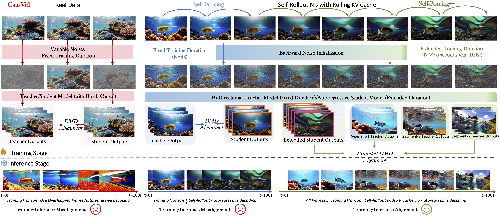

## Self-Forcing++: Towards Minute-Scale High-Quality Video Generation
[]()
[](https://github.com/justincui03/Self-Forcing-Plus-Plus)
[](https://self-forcing-plus-plus.github.io/)

[](https://self-forcing-plus-plus.github.io/)

## ✨ TDLR: Multi-Minute Streaming Long Video Generation with High Quality

This work tackles the challenge of generating long, high-quality videos with diffusion models, which are usually limited by costly transformers and short-horizon teachers. We propose a simple method that leverages teacher knowledge and self-generated video segments to guide autoregressive students without retraining on long-video datasets. Our approach preserves temporal consistency, avoids error accumulation, and scales video length up to **4 minutes 15 seconds**, equivalent to **99.9%** of the maximum span supported by our base model's position embedding, significantly outperforming prior methods on fidelity and consistency benchmarks.

## ⚙️ Main Workflow

Bi-directional diffusion can be seen as a process of gradually restoring a degraded target. We adapt it to autoregressive generation by having a short-horizon teacher refine the student’s outputs and then distilling these correction knowledge back into the student model.

## 🔥 Concurrent Work
Both [Rolling Forcing](https://kunhao-liu.github.io/Rolling_Forcing_Webpage/) and [LongLive](https://nvlabs.github.io/LongLive/) , as well as [ours](https://self-forcing-plus-plus.github.io/), are able to generate high-quality videos up to multiple minutes long, which marks a significant advance in autoregressive long video generation compared to previous methods. While all methods adopt a windowed distillation strategy, **Rolling Forcing** introduces **progressively** varied noise levels across frames combined with attention sink frames, **LongLive** employs **sink frames** with KV recaching for prompt switching, **our** approach relies solely on historical KV cache without sink frames.

## Reproduce Our Work
Our code will be released soon. Our work can be reproduced based on [Self Forcing](https://github.com/guandeh17/Self-Forcing) by following [how to reproduce our work](https://self-forcing-plus-plus.github.io/#reproducing_results).


## Acknowledgement
We sincerely thank the following work for their exceptional effort.
- [Self-Forcing](https://github.com/guandeh17/Self-Forcing): the codebase we built upon. 
- [Wan](https://github.com/Wan-Video/Wan2.1): the base model we built upon.
- [CausVid](https://github.com/tianweiy/CausVid): the codebase that shows asymmetric distillation is possible.
- [DMD](https://github.com/tianweiy/DMD2): the key distillation technique used by our method

## Citation
Please consider citing our work if it's useful. Together we hope to make long video generation better and longer.
```bibtex
@misc{cui2025selfforcingminutescalehighqualityvideo,
      title={Self-Forcing++: Towards Minute-Scale High-Quality Video Generation}, 
      author={Justin Cui and Jie Wu and Ming Li and Tao Yang and Xiaojie Li and Rui Wang and Andrew Bai and Yuanhao Ban and Cho-Jui Hsieh},
      year={2025},
      eprint={2510.02283},
      archivePrefix={arXiv},
      primaryClass={cs.CV},
      url={https://arxiv.org/abs/2510.02283}, 
}
```
